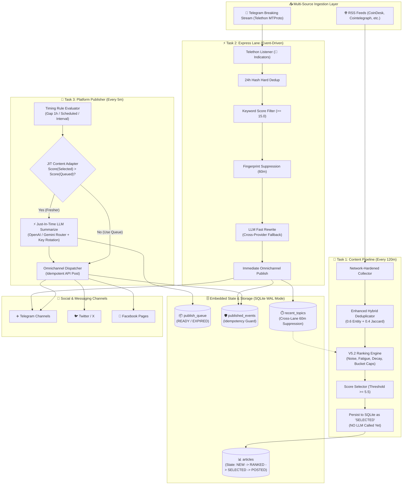
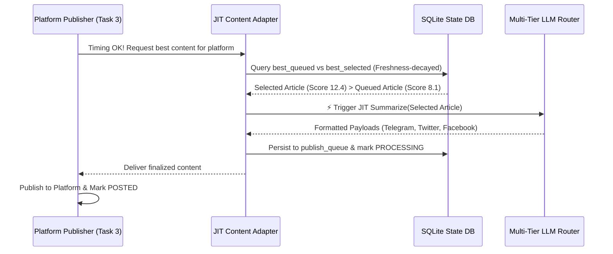

# ⚡ Autonomous AI News Engine (V5.2 / V2)
### *Production-Grade, Dual-Lane Real-Time News Curation with Just-In-Time (JIT) LLM Synthesis*

[](https://www.python.org/)
[](#-system-architecture)
[](https://platform.openai.com/)
[-red.svg?style=flat-square)](#1-just-in-time-jit-summarization-architecture)
[](https://www.sqlite.org/wal.html)
[](https://telegram.org)
[](LICENSE)

> An enterprise-ready, autonomous news curation and publishing engine designed for high-signal financial and cryptocurrency ecosystems. It pairs **event-driven real-time streaming** (Telegram Express Lane) with an **intelligent batch curation pipeline** (RSS Lane), featuring **Just-In-Time (JIT) LLM Synthesis**, **Cross-Provider Dynamic Model Routing**, **In-Memory Rate Limiting**, and a **V5.2 Deterministic Heuristic Scoring Engine**.

---

## 📑 Table of Contents
- [Executive Overview](#-executive-overview)
- [Key Technical Innovations](#-key-technical-innovations)
- [System Architecture](#-system-architecture)
- [Core AI & LLM Systems Engineering](#-core-ai--llm-systems-engineering)
  - [1. Just-In-Time (JIT) Summarization Architecture](#1-just-in-time-jit-summarization-architecture)
  - [2. Cross-Provider Dynamic LLM Routing & Fallback](#2-cross-provider-dynamic-llm-routing--fallback)
  - [3. In-Memory Rate Limiting Gatekeeper](#3-in-memory-rate-limiting-gatekeeper)
  - [4. Two-Stage LLM Synthesis & Vietnamese Polish](#4-two-stage-llm-synthesis--vietnamese-polish)
  - [5. Deterministic Regex Structured Output Parsing](#5-deterministic-regex-structured-output-parsing)
- [Algorithmic Curation & NLP Engineering](#-algorithmic-curation--nlp-engineering)
  - [1. Enhanced Hybrid NLP Deduplication Engine](#1-enhanced-hybrid-nlp-deduplication-engine)
  - [2. V5.2 Multi-Factor Editorial Ranking Engine](#2-v52-multi-factor-editorial-ranking-engine)
  - [3. Anti-PR, Advertising & Technical Analysis Suppression](#3-anti-pr-advertising--technical-analysis-suppression)
- [Production Engineering & Reliability](#-production-engineering--reliability)
  - [High-Concurrency SQLite WAL & Atomic Locks](#high-concurrency-sqlite-wal--atomic-locks)
  - [JIT Failure Cooldown & Retry State Machine](#jit-failure-cooldown--retry-state-machine)
  - [Self-Healing Watchdog & Routine Maintenance](#self-healing-watchdog--routine-maintenance)
- [Project Directory Structure](#-project-directory-structure)
- [Configuration & Environment Matrix](#-configuration--environment-matrix)
- [Quickstart & Local Execution](#-quickstart--local-execution)
- [Architecture Decision Records (ADRs)](#-architecture-decision-records-adrs)

---

## 🎯 Executive Overview

In financial markets, signal-to-noise ratio is critical. Naive AI news scrapers face three fatal flaws in production:
1. **Excessive LLM Token Costs**: Calling LLMs eagerly on all scraped news wastes inference budgets on articles that expire before ever being posted.
2. **Fragile Rate Limits & Single-Vendor Lock-in**: Hardcoding to a single LLM provider causes catastrophic downtime when hitting daily token limits (RPD/RPM) or provider outages.
3. **Noisy Speculative Content**: Markets are flooded with low-quality PR, referral spam, price predictions, and technical analysis chart chatter that dilute channel authority.

**Auto-Post-News (V5.2)** solves these challenges through a **state-machine-driven architecture**:
- **Zero Wasted Inference**: Employs **Just-In-Time (JIT) Summarization**—articles are scored and selected into SQLite first, and LLMs are invoked *only at the precise moment a platform is scheduled to publish*.
- **Autonomous Multi-Vendor Orchestration**: Supports seamless cross-provider fallback chains (`OpenAI` $\leftrightarrow$ `Google Gemini`), gated by an in-memory proactive rate limiter.
- **Strict Heuristic Quality Gating**: Filters out PR spam, Technical Analysis (TA), and speculation via mathematical heuristic scoring *before* content ever touches an LLM.

---

## 💡 Key Technical Innovations

- **Just-In-Time (JIT) Summarizer**: Saves $>75\%$ in LLM API spend by delaying text generation until the publishing window opens, ensuring only the freshest, highest-ranked article is summarized.
- **Cross-Provider Dynamic Routing**: The `_detect_provider()` engine dynamically maps model names (`gpt-4o-mini`, `gemini-2.5-flash`, `gemma-3-27b-it`) across OpenAI and Gemini API backends within a unified fallback loop.
- **In-Memory Rate Limiting Gatekeeper**: Proactively monitors Requests-Per-Day (RPD) and Requests-Per-Minute (RPM) in RAM, skipping exhausted models *before* generating network calls.
- **JIT Failure Cooldown & Resilience**: Implements an exponential backoff tracker with 5-minute cooldowns, max 2 retries, and automatic fallback to pre-queued content or `SKIPPED` terminal state.
- **Enhanced Hybrid NLP Deduplication**: Blended similarity engine ($0.6 \times \text{Named Entity Sim} + 0.4 \times \text{Token Jaccard}$) operating with two-stage text phrase and ticker normalization.
- **V5.2 Anti-PR & Technical Analysis Suppression**: Features a `-20.0` penalty bucket for advertising/referral spam and strict regex suppression for chart chatter (golden cross, open interest, liquidations, whale alerts).
- **SQLite WAL Concurrency**: Employs Write-Ahead Logging (WAL) and atomic `BEGIN IMMEDIATE` transactions for thread-safe state transitions across asynchronous background workers.

---

## 🏛️ System Architecture



---

## 🧠 Core AI & LLM Systems Engineering

### 1. Just-In-Time (JIT) Summarization Architecture
Traditional news automation architectures invoke LLMs immediately upon scraping. In high-frequency news feeds, 80% of scraped articles are eclipsed by newer developments before being posted. 

**Auto-Post-News (V5.2)** implements a **Deferred JIT Inference Pattern**:
1. **Lightweight Batch Ingestion**: The Content Pipeline gathers RSS feeds, computes hybrid deduplication, applies heuristic ranking, and flags the top candidate as `SELECTED` in SQLite. **Zero LLM tokens are consumed.**
2. **Just-In-Time Invocation**: When the Platform Publisher signals that a channel is ready to receive a post (e.g. 1-hour gap satisfied), `get_or_create_publish_content()` compares:
   - The best pre-summarized article in `publish_queue`.
   - The best unsummarized article in `articles` with state `SELECTED`.
3. **Execution**: If the unsummarized article boasts a higher freshness-adjusted score, the JIT adapter invokes the LLM pipeline, formats the multi-platform payloads, and pushes directly to the publisher.



---

### 2. Cross-Provider Dynamic LLM Routing & Fallback
The system completely abstracts LLM vendors behind a unified, resilient dispatcher:
- **Automatic Provider Detection**: `_detect_provider(model_name)` dynamically inspects model names:
  - Models with prefixes `gpt-`, `o1-`, `o3-`, `o4-`, `chatgpt` route to the **OpenAI API**.
  - Models with prefixes `gemini-` or `gemma-` route to the **Google Gemini API**.
- **Unified Degradation Chain**: `lane_models` can define cross-provider fallback sequences:
  ```python
  "lane_models": {
      "RSS": ["gpt-4o-mini", "gemini-2.5-flash", "gemma-3-27b-it"],
      "EXPRESS": ["gemma-3-27b-it"]
  }
  ```
- **Dynamic Key Pool Rotation**: Cycles through an array of API keys (`GEMINI_API_KEY_1..N` or `OPENAI_API_KEY_1..N`) upon receiving HTTP `429 (ResourceExhausted)`.

---

### 3. In-Memory Rate Limiting Gatekeeper
To prevent account bans and eliminate network roundtrip overhead from rate-limit rejections, `modules/pipeline/summarize.py` includes a thread-safe `InternalRateLimiter`:
- **Proactive Boundary Checks**: Enforces daily caps (RPD) and minute caps (RPM) per model:
  - `gemini-2.5-flash`: $1,500\text{ RPD}$, $15\text{ RPM}$
  - `gemma-3-27b-it`: $1,440\text{ RPD}$, $30\text{ RPM}$
  - `gpt-4o-mini`: $10,000\text{ RPD}$, $500\text{ RPM}$
- **Zero-Latency Circuit Breaker**: If a model reaches its internal quota, the gatekeeper intercepts the call instantly and escalates to the next model in the fallback chain without issuing an HTTP request.

---

### 4. Two-Stage LLM Synthesis & Vietnamese Polish
1. **Stage 1: Fact-Grounded Synthesis** (`T=0.3`):
   - Generates 3–5 bullet points strictly derived from source text.
   - Enforces financial terminology localization (`cryptocurrency` $\to$ `tiền mã hóa`) while preserving proper nouns, token symbols, and protocol names in original English.
2. **Stage 2: Vietnamese Editorial Polish** (`T=0.0`):
   - Optional pass using `gemma-3-27b-it` (configurable via `POLISH_ENABLED=True/False`) to correct diacritics, grammar, and headline formatting.
   - **Hallucination & Truncation Guard**: Discards the polish pass if the output length deviates by $>20\%$ relative to Stage 1.

---

### 5. Deterministic Regex Structured Output Parsing
LLM outputs are parsed through a multi-tiered regex extraction engine:
```
HEADLINE: <Catchy Title>|||SUMMARY: <Key Bullets>|||IMPACT: <Implication>|||HASHTAGS: #BTC #DeFi
```
- **Bottom-Up Tag Extraction**: Safely extracts hashtags and market implications even if the model varies label casing.
- **Label-Agnostic Fallback**: If an LLM drops labels entirely, the parser treats line 1 as the uppercase headline and remaining lines as the bulleted summary.

---

## 🔬 Algorithmic Curation & NLP Engineering

### 1. Enhanced Hybrid NLP Deduplication Engine
Articles are clustered across a 48-hour deduplication window using an entity-weighted Jaccard metric:

$$\text{Similarity}(A, B) = 0.6 \cdot \text{EntitySim}(A, B) + 0.4 \cdot \text{TokenJaccard}(A, B)$$

Where:
- $\text{EntitySim}(A, B) = \frac{|\text{Entities}_A \cap \text{Entities}_B|}{\max(|\text{Entities}_A|, |\text{Entities}_B|, 1)}$
- **Pre-Tokenization Phrase Normalization**: Normalizes multi-word entities (`"securities and exchange commission"` $\to$ `"sec"`, `"federal reserve"` $\to$ `"fed"`).
- **Post-Tokenization Ticker Normalization**: Unifies symbols (`"btc"` $\to$ `"bitcoin"`, `"eth"` $\to$ `"ethereum"`).
- **Event Clustering**: When $\text{Similarity} \ge 0.38$, articles are merged into a cluster under a `Lead Article`, incrementing `cluster_size` and tracking narrative continuity via `event_root_id` across a 5-day window.

---

### 2. V5.2 Multi-Factor Editorial Ranking Engine

Articles are ranked using a multi-factor mathematical scoring formula:

$$\text{BasePositive} = (\text{Base} + \text{PositiveKeywordScore} + \text{CapitalFlow}) \times \text{NoiseMultiplier}$$

$$\text{EditorialScore} = (\text{BasePositive} + \text{PenaltyKeyword} + \text{TrendBonus}) \times \text{SourceCredibility}$$

$$\text{FinalScore} = \text{EditorialScore} \times \text{TimeDecay} \times \text{EntityFatigueMultiplier} \times \text{TopicNoveltyMultiplier}$$

#### Ranking Engine Components:
| Component | Weight / Cap | Implementation Details |
|:---|:---:|:---|
| **Base Score** | $3.0$ | Default foundation score for all collected articles. |
| **Keyword Buckets** | Single-Best Cap | $\max(\text{market\_moving}(+4.0), \text{macro}(+5.0), \text{biz}(+8.0), \text{tech}(+3.0))$. |
| **Entity Bonus (V5.2)** | $+2.0 / +1.0$ | Major Tokens ($+2.0$), Exchanges ($+2.0$), Macro Entities ($+1.0$). Single-best applied. |
| **Noise Penalty** | $\times 0.5$ | Halves positive score if headline mentions BTC/ETH without substantive market event. |
| **Capital Flow Regex** | $+2.0$ | Matches institutional volume $\ge \$50\text{M}$, $\$1\text{B}+$, or $100+\text{ BTC/ETH}$. |
| **Cluster Trend Bonus** | $+1.0 \times (\text{ClusterSize} - 1)$ | Capped at $+4.0$ (max cluster size 5). Boosts news covered across multiple outlets. |
| **Exponential Time Decay** | $e^{-0.035 \cdot \Delta t}$ | Halves score after $\approx 20\text{ hours}$; asymptotic floor at $0.12$ prevents stale overflow. |
| **Entity Fatigue (V5.1)** | $\max(1.0 - 0.2 \cdot N, 0.0)$ | Linear penalty ($1.0 \to 0.8 \to 0.6 \dots$) based on entity mentions in 24h posted history. |
| **Min Publish Threshold** | **$5.5$** | Strict threshold in Selector (Phase 4); prevents mediocre articles from reaching JIT stage. |

---

### 3. Anti-PR, Advertising & Technical Analysis Suppression
To maintain high editorial standards, V5.2 implements strict negative penalty buckets:
- **Advertising / PR Penalty (`-20.0`)**: Harsh penalty docking headlines with promo keywords:
  `giveaway`, `promo`, `referral`, `sponsored`, `VIP`, `VVIP`, `AMA`, `product launch`.
- **Technical Analysis (TA) & Chart Chatter Penalty (`-18.0`)**: Docking speculative TA jargon:
  `golden cross`, `death cross`, `funding rate`, `open interest`, `liquidation`, `whale alert`, `fear and greed`, `FUD`, `FOMO`, `analyst predicts`, `RSI`, `MACD`, `breakout`.
- **Speculation Soft Penalty (`-12.0`)**: Extra compound penalty applied if price analysis coincides with major token names without hard news backing.

---

## 🛡️ Production Engineering & Reliability

### High-Concurrency SQLite WAL & Atomic Locks
- **Write-Ahead Logging (WAL)**: Allows non-blocking concurrent reads while background workers write state updates.
- **Atomic Worker Claims**: Uses `BEGIN IMMEDIATE` transactions to claim articles from `NEW` to `PROCESSING`, ensuring zero double-processing across concurrent tasks.

### JIT Failure Cooldown & Retry State Machine
When an external LLM fails during JIT summarization, the system executes an automated recovery lifecycle:

```
[JIT Failure Detected]
        │
        ▼
   Attempt < 2? ──── Yes ───► Cooldown Tracker (5 min wait) ───► Fallback to Queue
        │
        No (Exhausted)
        ▼
Transition Article to 'SKIPPED' (Permanently Dropped)
```

### Self-Healing Watchdog & Routine Maintenance
- **Zombie Worker Recovery**: `release_processing_timeout()` scans for articles stuck in `PROCESSING` for $>30$ minutes and resets them to `NEW` with randomized jitter ($0\text{--}5\text{m}$).
- **Automated Vacuum & Garbage Collection**: Automatically purges expired queue records ($>24\text{h}$), stale fingerprints ($>48\text{h}$), and executes SQLite `VACUUM` to reclaim disk space.

---

## 📂 Project Directory Structure

```
Auto-post-news/
├── main.py                          # Master async orchestrator (Content, JIT Publisher, Express)
├── config.py                        # Central configuration, scoring weights, hot-reload & rate limits
├── models.py                        # TypedDict schemas, URL normalization & deterministic SHA1 hashing
├── requirements.txt                 # Pinned project dependencies
├── Procfile                         # Cloud deployment process descriptor (Railway / Render)
├── .env.example                     # Comprehensive environment variable template
├── .gitignore                       # Clean repository exclusions
│
├── modules/                         # Core system domain modules
│   ├── state_manager.py             # SQLite WAL database, atomic claims, queue CRUD & watchdog
│   │
│   ├── pipeline/                    # Curated RSS Pipeline (Batch Ingestion & Scoring)
│   │   ├── collector.py             # Network-hardened multi-feed RSS fetcher
│   │   ├── deduplicator.py          # Enhanced Hybrid Similarity (Entity 0.6 + Token 0.4)
│   │   ├── rank.py                  # V5.2 Multi-factor Ranking Engine & Anti-PR filters
│   │   ├── selector.py              # Score threshold filter (>= 5.5) & topic diversity checker
│   │   └── summarize.py             # JIT LLM synthesis with cross-provider routing & rate limiter
│   │
│   ├── express/                     # Real-Time Event Lane (Streaming Breaking News)
│   │   ├── listener.py              # Telethon event-driven breaking news consumer
│   │   ├── filter.py                # Fast keyword threshold scoring engine
│   │   └── fingerprint.py           # Proper-noun, ticker & title-case entity extractor
│   │
│   └── publishing/                  # Omnichannel Publishing Layer
│       ├── publisher.py             # Telegram, Twitter, Facebook dispatchers & idempotency guards
│       ├── timing.py                # Per-platform timing rules (gap / scheduled / interval)
│       └── telethon_client.py       # Shared singleton Telethon MTProto client
│
├── auto_announcement.py             # Standalone weekly materialized announcement scheduler
├── generate_string_session.py       # Utility to generate Telegram MTProto string sessions
│
└── docs/                            # Deep-dive engineering specifications
    ├── PROJECT_SNAPSHOT.md          # Architectural snapshot & source of truth
    ├── ranking_engine_documentation.md # Mathematical derivation of scoring weights
    ├── deduplication_documentation.md  # Dedup clustering & benchmark documentation
    └── RAILWAY_DEPLOYMENT.md        # Cloud deployment & container guide
```

---

## ⚙️ Configuration & Environment Matrix

Key environment variables configurable via `.env`:

| Category | Variable | Default | Description |
|:---|:---|:---:|:---|
| **Orchestration** | `CONTENT_PIPELINE_INTERVAL` | `120` | Interval in minutes between RSS batch curation cycles. |
| | `PUBLISH_CHECK_INTERVAL` | `5` | Interval in minutes between publisher timing checks. |
| | `QUEUE_MAX_AGE_HOURS` | `6` | Maximum time an article remains in `READY` queue before expiring. |
| | `FINGERPRINT_WINDOW_MINUTES`| `60` | Cooldown window for cross-lane topic suppression. |
| | `EXPRESS_THROTTLE_MINUTES` | `3` | Minimum time gap enforced between consecutive Express posts. |
| **LLM Config** | `LLM_PROVIDER` | `openai` | Default provider: `openai` or `gemini`. |
| | `POLISH_ENABLED` | `False` | Toggle Stage 2 Vietnamese Polish step via Gemma 27B. |
| | `OPENAI_API_KEY` | — | Primary OpenAI API Key (supports key rotation via `_1..9`). |
| | `GEMINI_API_KEY` | — | Primary Google Gemini API key (supports key rotation via `_1..9`). |
| **Telegram Timing** | `TG_PUBLISH_MODE` | `gap` | Mode: `gap` (channel gap check), `scheduled`, or `interval`. |
| | `TG_MIN_GAP_HOURS` | `1` | Minimum hours required between posts in gap mode. |
| | `TG_GAP_CHANNEL_ID` | — | Channel ID for live Telethon message gap inspection. |
| **Twitter / X** | `TW_PUBLISH_MODE` | `scheduled` | Default scheduled broadcast mode. |
| | `TW_SCHEDULE` | `07:00,...,00:00` | Fixed time slots for daily publication. |

---

## 🚀 Quickstart & Local Execution

### 1. Prerequisites
- Python 3.10+
- Telegram API Credentials (`api_id` and `api_hash` from [my.telegram.org](https://my.telegram.org))
- OpenAI API Key and/or Google Gemini API Key

### 2. Installation
```bash
# Clone the repository
git clone https://github.com/Duy137/Auto-post-news.git
cd Auto-post-news

# Create virtual environment
python -m venv venv
source venv/bin/activate  # On Windows: venv\Scripts\activate

# Install dependencies
pip install -r requirements.txt
```

### 3. Environment Configuration
```bash
cp .env.example .env
# Fill in your OPENAI_API_KEY / GEMINI_API_KEY, TELEGRAM_BOT_TOKEN, and TG_API_ID / HASH
```

### 4. Interactive Telegram Session Setup (One-Time)
```bash
# Generate MTProto string session to avoid committing local .session binary files
python generate_string_session.py
# Copy the printed string into TG_STRING_SESSION in .env
```

### 5. Running Simulations & Unit Verification
```bash
# Test the V5.2 Ranking Engine & Negative PR Buckets
python modules/pipeline/rank.py

# Test the Enhanced NLP Deduplication clustering
python modules/pipeline/deduplicator.py

# Test the State Manager concurrency & atomic claims
python modules/state_manager.py
```

### 6. Production Launch
```bash
python main.py
```

---

## 🏛️ Architecture Decision Records (ADRs)

### ADR 001: SQLite WAL over Redis / PostgreSQL
- **Context**: The system operates as a single-node autonomous microservice deployed on containerized infrastructure (Railway/Docker).
- **Decision**: Use SQLite in `Write-Ahead Logging (WAL)` mode with atomic `BEGIN IMMEDIATE` transactions rather than hosting external database services.
- **Consequences**: Zero infrastructure cost, sub-millisecond query latency, zero connection pooling overhead, and fully embedded ACID state persistence.

### ADR 002: Just-In-Time (JIT) Summarization over Eager Pre-Summarization
- **Context**: In V5.0, articles were summarized immediately during batch RSS ingestion. Many articles expired in the queue or were superseded by breaking news, burning costly LLM tokens unnecessarily.
- **Decision**: In V5.2 (Branch V2), defer summarization until the platform publisher triggers a posting window, comparing candidate scores dynamically.
- **Consequences**: Reduces LLM API consumption by $>75\%$, guarantees posts are summarized with the latest prompt instructions, and prevents rate-limit waste.

### ADR 003: Cross-Provider Dynamic Routing over Single-Vendor Lock-in
- **Context**: Reliance on a single LLM vendor exposed the bot to sudden quota exhaustion (HTTP 429) or model deprecation.
- **Decision**: Implement `_detect_provider()` with cross-vendor model lists (`gpt-4o-mini` $\to$ `gemini-2.5-flash` $\to$ `gemma-3-27b-it`) and proactive in-memory rate limiting.
- **Consequences**: 99.9% uptime reliability, seamless model degradation, and flexibility to arbitrate between price and quality across vendors.

### ADR 004: Heuristic Hybrid NLP over Dense Vector Embeddings
- **Context**: Deduplication and relevance filtering must process 200 articles in under 100 milliseconds without incurring embedding API expenses.
- **Decision**: Implement an entity-weighted Jaccard algorithm ($0.6 \text{ Entity} + 0.4 \text{ Token}$) with multi-layer dictionary normalization.
- **Consequences**: Zero embedding inference cost, deterministically explainable clustering, sub-10ms execution, and precise preservation of distinct token tickers (e.g. distinguishing "$SOL hack" from "$ETH hack").

---

## 👨‍💻 Engineering & Contact

- **Author**: [Duy137 (Z nguyen)](https://github.com/Duy137)
- **GitHub**: [@Duy137](https://github.com/Duy137)
- **Repository**: [Duy137/Auto-post-news](https://github.com/Duy137/Auto-post-news)
- **Specialization**: Autonomous Agent Architectures, LLM Systems Engineering, High-Reliability Automation Pipelines
