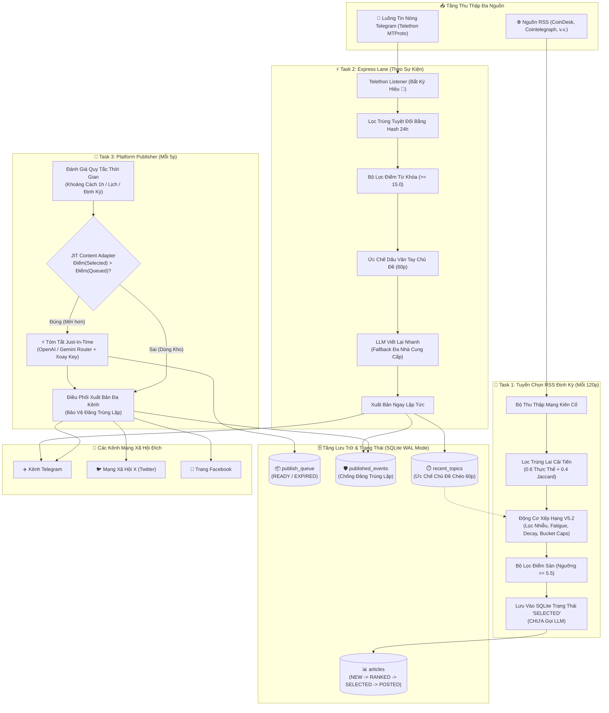
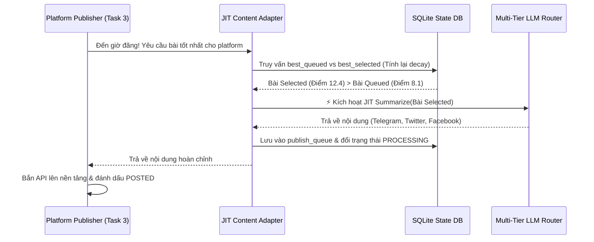

# ⚡ Autonomous AI News Engine (V5.2 / V2)
### *Hệ Thống Tự Động Biên Tập & Xuất Bản Tin Tức Đa Nền Tảng Cấp Production với Kiến Trúc Just-In-Time (JIT) LLM Synthesis*

[](https://github.com/Duy137/Auto-post-news/actions/workflows/ci.yml)
[](https://www.python.org/)
[](#-kiến-trúc-hệ-thống)
[](https://platform.openai.com/)
[-red.svg?style=flat-square)](#1-kiến-trúc-tổng-hợp-tin-just-in-time-jit-summarization)
[](https://www.sqlite.org/wal.html)
[](https://telegram.org)
[](LICENSE)

> Một nền tảng tự động hóa biên tập và xuất bản tin tức cấp doanh nghiệp, được thiết kế chuyên biệt cho hệ sinh thái tài chính và tiền mã hóa đòi hỏi độ chính xác cao. Hệ thống kết hợp giữa **luồng xử lý sự kiện thời gian thực (Telegram Express Lane)** và **đường ống tuyển chọn tin tức định kỳ (RSS Lane)**, tích hợp cơ chế **tổng hợp tin Just-In-Time (JIT)**, **điều hướng mô hình LLM đa nhà cung cấp (Cross-Provider Routing)**, **bộ kiểm soát hạn ngạch Rate Limit trong bộ nhớ**, và **bộ chấm điểm Heuristic V5.2 tất định (Deterministic Ranking Engine)**.

---

## 📑 Mục Lục
- [Tổng Quan Dự Án](#-tổng-quan-dự-án)
- [Đột Phá Kỹ Thuật Nổi Bật](#-đột-phá-kỹ-thuật-nổi-bật)
- [Kiến Trúc Hệ Thống](#-kiến-trúc-hệ-thống)
- [Kỹ Thuật AI & LLM Systems Chuyên Sâu](#-kỹ-thuật-ai--llm-systems-chuyên-sâu)
  - [1. Kiến Trúc Tổng Hợp Tin Just-In-Time (JIT Summarization)](#1-kiến-trúc-tổng-hợp-tin-just-in-time-jit-summarization)
  - [2. Điều Hướng & Dự Phòng LLM Đa Nhà Cung Cấp (Cross-Provider Routing)](#2-điều-hướng--dự-phòng-llm-đa-nhà-cung-cấp-cross-provider-routing)
  - [3. Bộ Kiểm Soát Hạn Ngạch Trong Bộ Nhớ (Internal Rate Limiter Gatekeeper)](#3-bộ-kiểm-soát-hạn-ngạch-trong-bộ-nhớ-internal-rate-limiter-gatekeeper)
  - [4. Quy Trình Tổng Hợp & Hiệu Đính Tiếng Việt Hai Giai Đoạn](#4-quy-trình-tổng-hợp--hiệu-đính-tiếng-việt-hai-giai-đoạn)
  - [5. Bóc Tách Cấu Trúc Đầu Ra Tất Định Bằng Regex](#5-bóc-tách-cấu-trúc-đầu-ra-tất-định-bằng-regex)
- [Kỹ Thuật Tuyển Chọn & Thuật Toán NLP](#-kỹ-thuật-tuyển-chọn--thuật-toán-nlp)
  - [1. Động Cơ Lọc Trùng NLP Lai Cải Tiến (Enhanced Hybrid Deduplication)](#1-động-cơ-lọc-trùng-nlp-lai-cải-tiến-enhanced-hybrid-deduplication)
  - [2. Động Cơ Chấm Điểm Biên Tập Đa Nhân Tố V5.2](#2-động-cơ-chấm-điểm-biên-tập-đa-nhân-tố-v52)
  - [3. Cơ Chế Triệt Tiêu Tin PR, Quảng Cáo & Phân Tích Kỹ Thuật (TA)](#3-cơ-chế-triệt-tiêu-tin-pr-quảng-cáo--phân-tích-kỹ-thuật-ta)
- [Kỹ Thuật Production & Độ Tin Cậy Hệ Thống](#-kỹ-thuật-production--độ-tin-cậy-hệ-thống)
  - [Xử Lý Đồng Thời Cao Với SQLite WAL & Khóa Nguyên Tử](#xử-lý-đồng-thời-cao-với-sqlite-wal--khóa-nguyên-tử)
  - [Máy Trạng Thái Xử Lý Lỗi JIT & Cơ Chế Thử Lại (Cooldown & Retry Tracker)](#máy-trạng-thái-xử-lý-lỗi-jit--cơ-chế-thử-lại-cooldown--retry-tracker)
  - [Watchdog Tự Phục Hồi & Dọn Dẹp Cơ Sở Dữ Liệu Định Kỳ](#watchdog-tự-phục-hồi--dọn-dẹp-cơ-sở-dữ-liệu-định-kỳ)
- [Cấu Trúc Thư Mục Dự Án](#-cấu-trúc-thư-mục-dự-án)
- [Bảng Cấu Hình & Biến Môi Trường (.env)](#-bảng-cấu-hình--biến-môi-trường-env)
- [Hướng Dẫn Cài Đặt & Chạy Cục Bộ](#-hướng-dẫn-cài-đặt--chạy-cục-bộ)
- [Hồ Sơ Quyết Định Kiến Trúc (ADRs)](#-hồ-sơ-quyết-định-kiến-trúc-adrs)

---

## 🎯 Tổng Quan Dự Án

Trong thị trường tài chính và tiền mã hóa, tỷ lệ tín hiệu trên nhiễu (Signal-to-Noise Ratio) đóng vai trò sống còn. Các bot cào tin tức AI thông thường luôn gặp phải 3 điểm nghẽn lớn khi triển khai thực tế:
1. **Lãng phí chi phí Token LLM quá lớn**: Việc gọi LLM tóm tắt ngay lập tức toàn bộ tin cào được dẫn tới lãng phí ngân sách cho những bài viết bị trôi hoặc hết hạn trước khi có cơ hội đăng tải.
2. **Dễ bị chạm trần Rate Limit & Phụ thuộc vào một nhà cung cấp (Vendor Lock-in)**: Gắn cứng vào một API duy nhất sẽ làm sập toàn bộ hệ thống khi bị khóa hạn ngạch ngày (RPD/RPM) hoặc khi API gặp sự cố.
3. **Nhiễu loạn thông tin suy đoán**: Kênh tin tức dễ bị ngập bởi bài PR rác, link mời chào (referral), dự đoán giá ảo và phân tích biểu đồ kỹ thuật vô giá trị làm giảm uy tín của kênh.

**Auto-Post-News (V5.2)** giải quyết triệt để các vấn đề trên thông qua **kiến trúc phân tách trạng thái thông minh**:
- **Không Lãng Phí Token**: Ứng dụng mô hình **Just-In-Time (JIT) Summarization**—tin tức chỉ được lọc, chấm điểm và lưu trạng thái vào SQLite, LLM chỉ được kích hoạt *ngay tại thời điểm một nền tảng sẵn sàng đăng bài*.
- **Điều Phối Đa Nhà Cung Cấp Tự Động**: Hỗ trợ chuỗi dự phòng xuyên nhà cung cấp (`OpenAI` $\leftrightarrow$ `Google Gemini`), được bảo vệ bởi cổng kiểm soát hạn ngạch trong RAM.
- **Lọc Nhiễu Bằng Thuật Toán Khắt Khe**: Triệt tiêu tin PR, phân tích kỹ thuật (TA) và suy đoán giá thông qua công thức Heuristic toán học *trước khi* văn bản chạm đến LLM.

---

## 💡 Đột Phá Kỹ Thuật Nổi Bật

- **Bộ Biên Tập Just-In-Time (JIT)**: Tiết kiệm $>75\%$ chi phí API LLM nhờ cơ chế hoãn gọi tóm tắt cho tới đúng khung giờ xuất bản, đảm bảo chỉ có bài viết mới nhất và điểm cao nhất mới tiêu tốn token.
- **Điều Hướng Động Đa Nhà Cung Cấp**: Hàm `_detect_provider()` tự động phân loại tên mô hình (`gpt-4o-mini`, `gemini-2.5-flash`, `gemma-3-27b-it`) để chuyển hướng gọi API OpenAI hoặc Gemini trong cùng một vòng lặp dự phòng.
- **Cổng Kiểm Soát Hạn Ngạch Trong Bộ Nhớ (Internal Rate Limiter)**: Tự động đếm số yêu cầu theo ngày (RPD) và theo phút (RPM) trong RAM, chủ động bỏ qua mô hình đã cạn hạn ngạch *trước khi* phát sinh network request.
- **Khả Năng Chịu Lỗi & Cơ Chế Hồi Phục JIT**: Quản lý lỗi LLM với thời gian chờ (cooldown 5 phút), tối đa 2 lần thử lại, tự động fallback sang bài dự phòng trong kho hoặc đánh dấu `SKIPPED`.
- **Động Cơ Lọc Trùng NLP Lai Cải Tiến**: Kết hợp đo độ tương đồng danh từ riêng và Jaccard từ vựng ($0.6 \times \text{Entity Sim} + 0.4 \times \text{Token Jaccard}$) cùng bộ chuẩn hóa 2 giai đoạn (Pre & Post Tokenization).
- **Bộ Lọc Heuristic V5.2 Chặn PR & Phân Tích Kỹ Thuật**: Phạt nặng `-20.0` điểm cho tin quảng cáo/referral và áp dụng Regex chặn triệt để thuật ngữ TA (golden cross, open interest, liquidation, whale alert).
- **Xử Lý Đồng Thời An Toàn Với SQLite WAL**: Chế độ Write-Ahead Logging kết hợp giao dịch nguyên tử `BEGIN IMMEDIATE` loại bỏ hoàn toàn tình trạng xung đột (race conditions) giữa các worker bất đồng bộ.

---

## 🏛️ Kiến Trúc Hệ Thống



---

## 🧠 Kỹ Thuật AI & LLM Systems Chuyên Sâu

### 1. Kiến Trúc Tổng Hợp Tin Just-In-Time (JIT Summarization)
Kiến trúc tự động hóa truyền thống thường gọi LLM ngay khi cào dữ liệu. Trong thị trường tin tức tần suất cao, 80% bài viết bị che lấp bởi các tin tức mới hơn trước khi kịp đến lượt đăng.

**Auto-Post-News (V5.2)** triển khai **Mô hình Trì hoãn Suy luận JIT (Deferred JIT Inference Pattern)**:
1. **Thu thập hàng loạt nhẹ nhàng**: Pipeline RSS quét tin, khử trùng lặp, chấm điểm Heuristic và đánh dấu ứng viên số 1 là `SELECTED` trong SQLite. **Hoàn toàn không tiêu tốn token LLM.**
2. **Kích hoạt đúng thời điểm**: Khi Platform Publisher xác nhận kênh đích đã thỏa mãn khoảng cách đăng bài (ví dụ: cách bài trước $\ge 1\text{ tiếng}$), hàm `get_or_create_publish_content()` thực hiện so sánh:
   - Bài viết đã được tóm tắt sẵn trong `publish_queue`.
   - Bài viết mới chưa tóm tắt trong bảng `articles` có trạng thái `SELECTED`.
3. **Thực thi**: Nếu bài viết chưa tóm tắt có điểm số (sau khi tính lại độ tươi) cao hơn, JIT Adapter mới kích hoạt LLM, định dạng payload cho các nền tảng và chuyển giao cho bộ xuất bản.



---

### 2. Điều Hướng & Dự Phòng LLM Đa Nhà Cung Cấp (Cross-Provider Routing)
Hệ thống trừu tượng hóa hoàn toàn các nhà cung cấp LLM phía sau một cổng điều phối kiên cố:
- **Tự động nhận diện Provider**: Hàm `_detect_provider(model_name)` phân tích tên model:
  - Tên chứa tiền tố `gpt-`, `o1-`, `o3-`, `o4-`, `chatgpt` $\to$ Điều hướng tới **OpenAI API**.
  - Tên chứa tiền tố `gemini-` hoặc `gemma-` $\to$ Điều hướng tới **Google Gemini API**.
- **Chuỗi dự phòng suy thoái thống nhất**: Danh sách `lane_models` có thể định nghĩa chuỗi fallback chéo:
  ```python
  "lane_models": {
      "RSS": ["gpt-4o-mini", "gemini-2.5-flash", "gemma-3-27b-it"],
      "EXPRESS": ["gemma-3-27b-it"]
  }
  ```
- **Xoay vòng kho API Key linh hoạt**: Tự động chuyển key tiếp theo trong mảng (`GEMINI_API_KEY_1..N` hoặc `OPENAI_API_KEY_1..N`) ngay khi nhận mã lỗi HTTP `429 (ResourceExhausted)`.

---

### 3. Bộ Kiểm Soát Hạn Ngạch Trong Bộ Nhớ (Internal Rate Limiter Gatekeeper)
Để phòng ngừa việc tài khoản bị khóa và loại bỏ độ trễ vô ích do gọi API thất bại, `modules/pipeline/summarize.py` tích hợp lớp `InternalRateLimiter`:
- **Chủ động chặn trước**: Thiết lập giới hạn ngày (RPD) và phút (RPM) cho từng model:
  - `gemini-2.5-flash`: $1,500\text{ RPD}$, $15\text{ RPM}$
  - `gemma-3-27b-it`: $1,440\text{ RPD}$, $30\text{ RPM}$
  - `gpt-4o-mini`: $10,000\text{ RPD}$, $500\text{ RPM}$
- **Ngắt mạch không độ trễ (Circuit Breaker)**: Nếu model đạt ngưỡng giới hạn, cổng kiểm soát lập tức chuyển tiếp sang model fallback tiếp theo trong chuỗi mà không cần phát sinh HTTP request ra ngoài.

---

### 4. Quy Trình Tổng Hợp & Hiệu Đính Tiếng Việt Hai Giai Đoạn
1. **Giai đoạn 1: Tổng hợp bám sát dữ liệu (Fact-Grounded Synthesis)** (`T=0.3`):
   - Trích xuất 3–5 gạch đầu dòng cốt lõi hoàn toàn từ nội dung bài gốc.
   - Chuẩn hóa thuật ngữ tài chính tiếng Việt (`cryptocurrency` $\to$ `tiền mã hóa`), giữ nguyên danh từ riêng, tên dự án, mã token và tên sàn bằng tiếng Anh gốc.
2. **Giai đoạn 2: Hiệu đính biên tập tiếng Việt (Vietnamese Editorial Polish)** (`T=0.0`):
   - Bước tùy chọn sử dụng `gemma-3-27b-it` (bật/tắt linh hoạt bằng biến môi trường `POLISH_ENABLED=True/False`) nhằm chuẩn hóa dấu câu, ngữ pháp và định dạng tiêu đề viết HOA.
   - **Thanh chắn chống ảo giác & cắt xén (Length Delta Guard)**: Tự động hủy bỏ bản hiệu đính nếu độ dài văn bản lệch quá $\pm 20\%$ so với bản Giai đoạn 1.

---

### 5. Bóc Tách Cấu Trúc Đầu Ra Tất Định Bằng Regex
Dữ liệu trả về từ LLM được phân tích qua bộ bóc tách Regex nhiều tầng:
```
HEADLINE: <Tiêu Đề Ngắn Viết Hoa>|||SUMMARY: <Nội Dung Chi Tiết>|||IMPACT: <Tác Động>|||HASHTAGS: #BTC #DeFi
```
- **Trích xuất thẻ ngược từ dưới lên**: Bóc tách chính xác khối Hashtags và Impact kể cả khi model thay đổi kiểu viết hoa/thường của nhãn.
- **Cơ chế Fallback không phụ thuộc nhãn**: Nếu LLM bỏ sót toàn bộ nhãn cấu trúc, hệ thống tự động nhận diện dòng đầu tiên làm tiêu đề và các dòng còn lại làm nội dung tóm tắt.

---

## 🔬 Kỹ Thuật Tuyển Chọn & Thuật Toán NLP

### 1. Động Cơ Lọc Trùng NLP Lai Cải Tiến (Enhanced Hybrid Deduplication)
Các bài báo được gom cụm trong cửa sổ 48 giờ dựa trên công thức lai kết hợp danh từ riêng:

$$\text{Similarity}(A, B) = 0.6 \cdot \text{EntitySim}(A, B) + 0.4 \cdot \text{TokenJaccard}(A, B)$$

Trong đó:
- $\text{EntitySim}(A, B) = \frac{|\text{Entities}_A \cap \text{Entities}_B|}{\max(|\text{Entities}_A|, |\text{Entities}_B|, 1)}$
- **Chuẩn hóa cụm từ trước Tokenize**: Quy đổi các tổ chức nhiều chữ (`"securities and exchange commission"` $\to$ `"sec"`, `"federal reserve"` $\to$ `"fed"`).
- **Chuẩn hóa Ticker sau Tokenize**: Đồng nhất các ký hiệu tiền tệ (`"btc"` $\to$ `"bitcoin"`, `"eth"` $\to$ `"ethereum"`).
- **Gom cụm sự kiện (Event Clustering)**: Khi $\text{Similarity} \ge 0.38$, bài viết được gom vào một cụm dưới quyền một `Lead Article`, tăng `cluster_size` và theo dõi dòng chảy sự kiện qua `event_root_id` trong 5 ngày.

---

### 2. Động Cơ Chấm Điểm Biên Tập Đa Nhân Tố V5.2

Mỗi bài viết được gán điểm chất lượng khách quan thông qua công thức toán học:

$$\text{BasePositive} = (\text{Base} + \text{PositiveKeywordScore} + \text{CapitalFlow}) \times \text{NoiseMultiplier}$$

$$\text{EditorialScore} = (\text{BasePositive} + \text{PenaltyKeyword} + \text{TrendBonus}) \times \text{SourceCredibility}$$

$$\text{FinalScore} = \text{EditorialScore} \times \text{TimeDecay} \times \text{EntityFatigueMultiplier} \times \text{TopicNoveltyMultiplier}$$

#### Bảng Chi Tiết Thành Phần Chấm Điểm:
| Thành phần | Trọng số / Mức chặn | Mục đích kỹ thuật |
|:---|:---:|:---|
| **Base Score** | $3.0$ | Điểm sàn mặc định cho mọi bài viết hợp lệ. |
| **Keyword Buckets** | Single-Best Cap | $\max(\text{market\_moving}(+4.0), \text{macro}(+5.0), \text{biz}(+8.0), \text{tech}(+3.0))$. |
| **Entity Bonus (V5.2)** | $+2.0 / +1.0$ | Thưởng thực thể: Major Tokens ($+2.0$), Exchanges ($+2.0$), Macro ($+1.0$). Lấy mức cao nhất. |
| **Noise Penalty** | $\times 0.5$ | Phạt chia đôi điểm dương nếu tiêu đề nhắc BTC/ETH nhưng không có sự kiện thực chất. |
| **Capital Flow Regex** | $+2.0$ | Thưởng bài có dòng vốn lớn $\ge \$50\text{M}$, $\$1\text{B}+$, hoặc $100+\text{ BTC/ETH}$. |
| **Cluster Trend Bonus** | $+1.0 \times (\text{ClusterSize} - 1)$ | Giới hạn tối đa $+4.0$ (khi 5 nguồn cùng đưa tin). Ưu tiên tin nóng toàn thị trường. |
| **Exponential Time Decay** | $e^{-0.035 \cdot \Delta t}$ | Giảm 50% điểm sau $\approx 20\text{ tiếng}$; chặn đáy ở $0.12$ tránh bài quá cũ lọt vào queue. |
| **Entity Fatigue (V5.1)** | $\max(1.0 - 0.2 \cdot N, 0.0)$ | Phạt tuyến tính ($1.0 \to 0.8 \to 0.6 \dots$) dựa trên số lần entity đã xuất hiện trong 24h qua. |
| **Min Publish Threshold** | **$5.5$** | Điểm sàn tối thiểu tại Selector (Phase 4) để được quyền đưa vào quy trình JIT. |

---

### 3. Cơ Chế Triệt Tiêu Tin PR, Quảng Cáo & Phân Tích Kỹ Thuật (TA)
Nhằm giữ vững định vị kênh tin tức chuyên nghiệp, V5.2 bổ sung các rổ điểm phạt nghiêm ngặt:
- **Phạt Tin Quảng Cáo / PR (`-20.0`)**: Đánh tụt điểm các bài chứa từ khóa thương mại:
  `giveaway`, `promo`, `referral`, `sponsored`, `VIP`, `VVIP`, `AMA`, `product launch`.
- **Phạt Phân Tích Kỹ Thuật (TA) & Cảm Xúc Ảo (`-18.0`)**: Loại bỏ các bài phân tích biểu đồ không có tin tức nền tảng:
  `golden cross`, `death cross`, `funding rate`, `open interest`, `liquidation`, `whale alert`, `fear and greed`, `FUD`, `FOMO`, `analyst predicts`, `RSI`, `MACD`, `breakout`.
- **Phạt Kép Tin Suy Đoán Giá (`-12.0`)**: Phạt bổ sung nếu bài phân tích giá đi kèm với tên token/sàn cụ thể mà không có sự kiện thực tế.

---

## 🛡️ Kỹ Thuật Production & Độ Tin Cậy Hệ Thống

### Xử Lý Đồng Thời Cao Với SQLite WAL & Khóa Nguyên Tử
- **Chế độ Write-Ahead Logging (WAL)**: Cho phép các luồng đọc dữ liệu song song mà không bị chặn khi có tiến trình đang ghi dữ liệu.
- **Tranh chấp bài bằng giao dịch nguyên tử**: Sử dụng `BEGIN IMMEDIATE` để khóa bài viết chuyển từ `NEW` sang `PROCESSING`, ngăn chặn hiện tượng 2 cron xử lý trùng một bài báo.

### Máy Trạng Thái Xử Lý Lỗi JIT & Cơ Chế Thử Lại (Cooldown & Retry Tracker)
Khi LLM gặp sự cố trong lúc JIT Summarize, hệ thống kích hoạt vòng đời tự phục hồi:

```
[Phát Hiện Lỗi JIT]
        │
        ▼
   Lần thử < 2? ──── Đúng ───► Đặt Cooldown (Chờ 5 phút) ───► Dùng bài có sẵn trong kho
        │
        Sai (Đã hết lượt)
        ▼
Chuyển bài sang 'SKIPPED' (Bỏ hẳn bài này)
```

### Watchdog Tự Phục Hồi & Dọn Dẹp Cơ Sở Dữ Liệu Định Kỳ
- **Giải cứu Worker bị treo (Zombie Killer)**: Hàm `release_processing_timeout()` quét các bài kẹt ở trạng thái `PROCESSING` quá 30 phút (do server restart đột ngột) và trả về `NEW` kèm độ trễ ngẫu nhiên ($0\text{--}5\text{ phút}$).
- **Dọn dẹp & Nén Database Tự Động**: Tự động xóa bài hết hạn trong kho ($>24\text{h}$), xóa dấu vân tay cũ ($>48\text{h}$) và thực thi lệnh `VACUUM` để tối ưu dung lượng ổ đĩa.

---

## 📂 Cấu Trúc Thư Mục Dự Án

```
Auto-post-news/
├── main.py                          # Master Orchestrator (Điều phối Content, JIT Publisher, Express)
├── config.py                        # Cấu hình trung tâm, trọng số điểm, hot-reload & rate limits
├── models.py                        # Định nghĩa TypedDict, chuẩn hóa URL & băm SHA1 ID tất định
├── requirements.txt                 # Danh sách thư viện phụ thuộc
├── Procfile                         # File thực thi triển khai trên Cloud (Railway / Render)
├── .env.example                     # Template cấu hình biến môi trường chi tiết
├── .gitignore                       # Danh sách loại trừ file nhạy cảm
│
├── modules/                         # Các module cốt lõi của hệ thống
│   ├── state_manager.py             # Quản lý SQLite WAL, giao dịch nguyên tử, kho bài & watchdog
│   │
│   ├── pipeline/                    # Pipeline tuyển chọn RSS định kỳ (Batch Ingestion & Scoring)
│   │   ├── collector.py             # Bộ thu thập RSS mạng kiên cố
│   │   ├── deduplicator.py          # Bộ lọc trùng lai cải tiến (Entity 0.6 + Token 0.4)
│   │   ├── rank.py                  # Động cơ xếp hạng V5.2 & bộ lọc chống PR
│   │   ├── selector.py              # Bộ lọc điểm sàn (>= 5.5) & đảm bảo tính đa dạng chủ đề
│   │   └── summarize.py             # Bộ tổng hợp JIT với điều hướng đa nhà cung cấp & rate limiter
│   │
│   ├── express/                     # Luồng sự kiện tin nhanh thời gian thực (Streaming)
│   │   ├── listener.py              # Bộ lắng nghe sự kiện tin nóng qua Telethon
│   │   ├── filter.py                # Bộ lọc điểm ngưỡng từ khóa nhanh
│   │   └── fingerprint.py           # Bộ trích xuất thực thể, ticker & danh từ riêng
│   │
│   └── publishing/                  # Tầng xuất bản đa kênh
│       ├── publisher.py             # Điều phối gửi tin Telegram, Twitter, Facebook & chống trùng
│       ├── timing.py                # Quy tắc tính giờ xuất bản (gap / scheduled / interval)
│       └── telethon_client.py       # Singleton Telethon MTProto Client dùng chung
│
├── auto_announcement.py             # Hệ thống lên lịch thông báo tuần tự động độc lập
├── generate_string_session.py       # Công cụ sinh mã phiên Telegram MTProto String Session
│
└── docs/                            # Tài liệu đặc tả kỹ thuật chi tiết
    ├── PROJECT_SNAPSHOT.md          # Bản chụp kiến trúc nguồn chân lý (Source of Truth)
    ├── ranking_engine_documentation.md # Chứng minh toán học công thức tính điểm
    ├── deduplication_documentation.md  # Tài liệu thuật toán lọc trùng & phân cụm
    └── RAILWAY_DEPLOYMENT.md        # Hướng dẫn đóng gói và triển khai Cloud
```

---

## ⚙️ Bảng Cấu Hình & Biến Môi Trường (.env)

Các biến môi trường chính có thể cấu hình qua `.env`:

| Nhóm | Tên biến | Mặc định | Mô tả chi tiết |
|:---|:---|:---:|:---|
| **Điều Phối** | `CONTENT_PIPELINE_INTERVAL` | `120` | Chu kỳ quét RSS và tuyển chọn tin (phút). |
| | `PUBLISH_CHECK_INTERVAL` | `5` | Chu kỳ kiểm tra điều kiện xuất bản (phút). |
| | `QUEUE_MAX_AGE_HOURS` | `6` | Thời gian tối đa bài nằm trong kho trước khi bị hết hạn (giờ). |
| | `FINGERPRINT_WINDOW_MINUTES`| `60` | Cửa sổ ức chế tin trùng chủ đề giữa 2 luồng RSS và Express (phút). |
| | `EXPRESS_THROTTLE_MINUTES` | `3` | Khoảng cách tối thiểu giữa 2 bài tin nóng Express liên tiếp (phút). |
| **Cấu Hình LLM** | `LLM_PROVIDER` | `openai` | Nhà cung cấp mặc định: `openai` hoặc `gemini`. |
| | `POLISH_ENABLED` | `False` | Bật/Tắt bước hiệu đính tiếng Việt Giai đoạn 2 qua Gemma 27B. |
| | `OPENAI_API_KEY` | — | API Key OpenAI chính (hỗ trợ xoay key qua `_1..9`). |
| | `GEMINI_API_KEY` | — | API Key Google Gemini chính (hỗ trợ xoay key qua `_1..9`). |
| **Thời Gian Telegram** | `TG_PUBLISH_MODE` | `gap` | Chế độ: `gap` (kiểm tra bài cuối trên kênh), `scheduled`, hoặc `interval`. |
| | `TG_MIN_GAP_HOURS` | `1` | Khoảng cách tối thiểu giữa 2 bài đăng trong chế độ gap (giờ). |
| | `TG_GAP_CHANNEL_ID` | — | ID Kênh để Telethon đọc thời gian bài đăng cuối cùng. |
| **Mạng Xã Hội X** | `TW_PUBLISH_MODE` | `scheduled` | Chế độ đăng bài theo khung giờ định sẵn. |
| | `TW_SCHEDULE` | `07:00,...,00:00` | Danh sách các khung giờ đăng bài cố định trong ngày. |

---

## 🚀 Hướng Dẫn Cài Đặt & Chạy Cục Bộ

### 1. Yêu cầu tiên quyết
- Python 3.10 trở lên
- Thông tin xác thực Telegram API (`api_id` và `api_hash` lấy từ [my.telegram.org](https://my.telegram.org))
- API Key của OpenAI và/hoặc Google Gemini

### 2. Cài đặt môi trường
```bash
# Clone repository
git clone https://github.com/Duy137/Auto-post-news.git
cd Auto-post-news

# Tạo môi trường ảo virtualenv
python -m venv venv
source venv/bin/activate  # Trên Windows: venv\Scripts\activate

# Cài đặt các thư viện cần thiết
pip install -r requirements.txt
```

### 3. Cấu hình biến môi trường
```bash
cp .env.example .env
# Điền các khóa API OPENAI_API_KEY / GEMINI_API_KEY, TELEGRAM_BOT_TOKEN, và TG_API_ID / HASH
```

### 4. Thiết lập phiên Telegram String Session (Chạy 1 lần duy nhất)
```bash
# Tạo mã MTProto String Session để tránh phải lưu file binary .session cục bộ
python generate_string_session.py
# Sao chép chuỗi mã sinh ra và gán vào biến TG_STRING_SESSION trong file .env
```

### 5. Chạy mô phỏng & Kiểm thử từng Module
```bash
# Kiểm thử động cơ xếp hạng V5.2 & bộ lọc chống PR
python modules/pipeline/rank.py

# Kiểm thử thuật toán lọc trùng & phân cụm NLP
python modules/pipeline/deduplicator.py

# Kiểm thử tính an toàn đồng thời của State Manager SQLite
python modules/state_manager.py
```

### 6. Khởi chạy toàn bộ hệ thống
```bash
python main.py
```

---

## 🏛️ Hồ Sơ Quyết Định Kiến Trúc (ADRs)

### ADR 001: Sử dụng SQLite WAL thay vì Redis / PostgreSQL
- **Bối cảnh**: Hệ thống vận hành dưới dạng microservice đơn node trên hạ tầng container (Railway/Docker).
- **Quyết định**: Sử dụng SQLite ở chế độ `Write-Ahead Logging (WAL)` kết hợp giao dịch nguyên tử `BEGIN IMMEDIATE` thay vì vận hành thêm cụm container Redis/PostgreSQL riêng biệt.
- **Hệ quả**: Chi phí hạ tầng bằng 0, độ trễ truy vấn dưới 1 mili-giây, không tốn tài nguyên quản lý kết nối (connection pool) và đảm bảo tính toàn vẹn dữ liệu ACID.

### ADR 002: Tóm Tắt Just-In-Time (JIT) thay vì Tóm Tắt Ngay Khi Cào (Eager)
- **Bối cảnh**: Ở phiên bản V5.0, bài viết được gọi LLM tóm tắt ngay trong đợt quét RSS. Nhiều bài bị hết hạn trong kho hoặc bị tin nóng vượt mặt, gây lãng phí ngân sách token LLM đắt đỏ.
- **Quyết định**: Trong V5.2 (Nhánh V2), hoãn việc tóm tắt cho tới khi bộ xuất bản mở khung giờ đăng, thực hiện so sánh điểm số và độ tươi ngay tại thời điểm xuất bản.
- **Hệ quả**: Cắt giảm $>75\%$ lượng token LLM tiêu thụ, đảm bảo bài đăng luôn được định dạng theo cấu hình prompt mới nhất và không lãng phí hạn ngạch API.

### ADR 003: Điều Hướng Mô Hình Đa Nhà Cung Cấp thay vì Phụ Thuộc Một Vendor
- **Bối cảnh**: Việc chỉ phụ thuộc vào một nhà cung cấp LLM khiến bot dễ bị ngưng hoạt động khi tài khoản chạm ngưỡng hạn ngạch (HTTP 429) hoặc khi dịch vụ của bên thứ ba gián đoạn.
- **Quyết định**: Triển khai hàm `_detect_provider()` hỗ trợ chuỗi mô hình hỗn hợp (`gpt-4o-mini` $\to$ `gemini-2.5-flash` $\to$ `gemma-3-27b-it`) kết hợp bộ đếm hạn ngạch trong RAM.
- **Hệ quả**: Đạt độ sẵn sàng 99.9%, tự động suy thoái mô hình mượt mà và linh hoạt tối ưu chi phí giữa các bên.

### ADR 004: Thuật Toán NLP Lai Heuristic thay vì Vector Embeddings (RAG)
- **Bối cảnh**: Quá trình lọc trùng và chấm điểm cần xử lý 200 bài báo trong thời gian dưới 100 mili-giây mà không làm phát sinh chi phí API Embeddings.
- **Quyết định**: Xây dựng thuật toán Jaccard có trọng số thực thể ($0.6 \text{ Entity} + 0.4 \text{ Token}$) kết hợp bộ từ điển chuẩn hóa ngữ nghĩa đa tầng.
- **Hệ quả**: Chi phí Embeddings bằng 0, thuật toán giải thích được 100% logic, thời gian thực thi dưới 10 mili-giây và phân biệt chính xác từng mã token riêng biệt (ví dụ: tách biệt rõ giữa vụ hack của "$SOL" và "$ETH").

---

## 👨‍💻 Thông Tin Tác Giả & Liên Hệ

- **Tác giả**: [Duy137 (Z nguyen)](https://github.com/Duy137)
- **GitHub**: [@Duy137](https://github.com/Duy137)
- **Repository**: [Duy137/Auto-post-news](https://github.com/Duy137/Auto-post-news)
- **Chuyên môn**: Kiến trúc Autonomous AI Agent, Kỹ thuật Hệ thống LLM (LLM Systems Engineering), Đường ống Tự động hóa Độ Tin Cậy Cao
